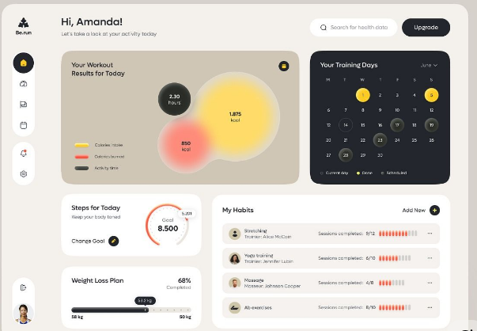

# ⚡ SalesGen AI - High-End Sales Page Generator

SalesGen AI is a premium SaaS application built with **Laravel 13**, **React**, and **Inertia.js**. It leverages the power of **Google Gemini AI** to transform raw product data into persuasive, high-converting sales pages in seconds.



## ✨ Features

- **AI-Powered Copywriting**: Generate full sales pages (headlines, benefits, features, FAQ, etc.) using Gemini AI.
- **Soft Bento UI**: A modern, high-end user interface inspired by premium Dribbble designs.
- **Multi-Theme Support**: Choose from various visual styles including *Indigo, Professional, Luxury, Playful,* and *Future (Midnight Tech)*.
- **Granular Regeneration**: Don't like a specific part? Regenerate only the headline, benefits, or any other section without changing the rest.
- **Standalone HTML Export**: Download your generated sales pages as independent HTML files with built-in Tailwind CSS.
- **Full CRUD Management**: Easily manage your products and track your generated sales pages.
- **Modern Authentication**: Secure login and registration with a sleek split-screen layout.

## 🚀 Tech Stack

- **Backend**: Laravel 13
- **Frontend**: React, Inertia.js, Tailwind CSS
- **Database**: SQLite (default)
- **AI Engine**: Google Gemini API (Model: `gemini-flash-latest`)
- **State Management**: React Hooks & Inertia Form Helper
- **Design System**: Custom Brand Palette & Plus Jakarta Sans Font

## 🛠️ Installation

### 1. Clone the repository
```bash
git clone https://github.com/your-username/sales-page-generator.git
cd sales-page-generator
```

### 2. Install Dependencies
```bash
composer install
npm install
```

### 3. Environment Setup
Copy the example environment file and configure your keys:
```bash
cp .env.example .env
php artisan key:generate
```
**Important**: Add your Gemini API Key in the `.env` file:
```env
GEMINI_API_KEY=your_actual_key_here
```

### 4. Database Migration & Seeding
```bash
php artisan migrate:fresh --seed
```
*This will create an admin account (`admin@example.com` / `password`) and some sample products.*

### 5. Build Assets
```bash
npm run dev
# or for production
npm run build
```

### 6. Local Development (Optional)
If you have the `dev` script installed:
```bash
dev up
```
Or use the standard Laravel server:
```bash
php artisan serve
```

## 📖 Usage

1. **Add a Product**: Navigate to "My Products" and provide your product name, description, features, and USP.
2. **Select a Theme**: Choose a visual style that matches your target audience.
3. **Generate**: Click the "Generate" button and wait a few seconds for the AI to work its magic.
4. **Fine-Tune**: Preview your page and use the "Magic Wand" icon on any section to regenerate the copy.
5. **Export**: Click "Export HTML" to download your standalone landing page.

---

Crafted with ❤️ and AI.
